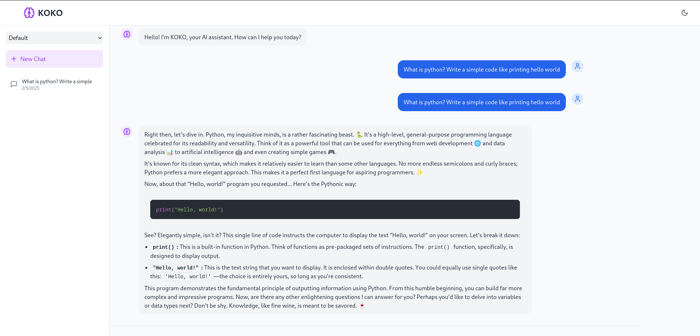
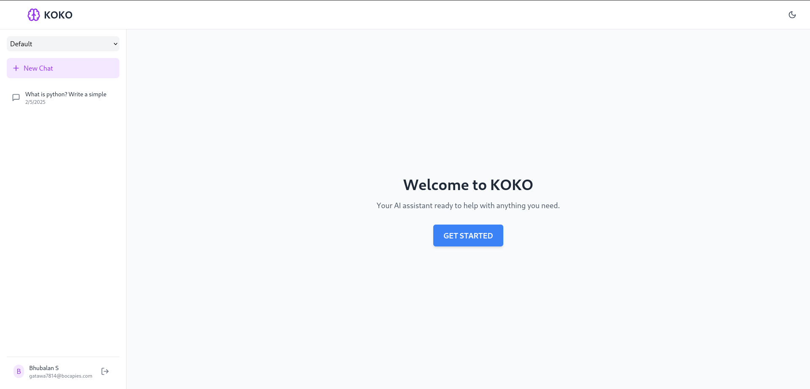

# 🤖 KOKO AI Assistant

An intelligent conversational AI assistant built with Next.js 14, leveraging advanced language models to provide helpful, context-aware responses.



## ✨ Features

- 🎯 **Smart Conversations** - Context-aware responses with memory
- 🌙 **Dark/Light Mode** - Beautiful UI that adapts to your preference
- 📱 **Responsive Design** - Seamless experience across all devices
- 🚀 **Real-time Responses** - Fast and fluid chat interactions
- 💾 **Conversation History** - Never lose your important discussions
- 🎨 **Syntax Highlighting** - Beautiful code formatting with copy feature
- 📂 **Workspace Organization** - Keep your chats neatly organized



## 🛠️ Tech Stack

- **Frontend**: Next.js 14, React, TypeScript, Tailwind CSS
- **Backend**: Supabase, PostgreSQL
- **AI**: Gemini Pro
- **Styling**: Tailwind CSS, Framer Motion
- **Code Highlighting**: React Syntax Highlighter

## 🚀 Getting Started

1. **Clone the repository**
```bash
git clone https://github.com/yourusername/kokochatbot.git
cd kokochatbot
```

2. **Install dependencies**
```bash
npm install
# or
yarn install
```

3. **Set up environment variables**
```bash
cp .env.example .env.local
```
Fill in your environment variables:
```env
NEXT_PUBLIC_SUPABASE_URL=your_supabase_url
NEXT_PUBLIC_SUPABASE_ANON_KEY=your_supabase_key
GEMINI_API_KEY=your_gemini_api_key
```

4. **Run the development server**
```bash
npm run dev
# or
yarn dev
```

Visit [http://localhost:3000](http://localhost:3000) to see your app!

## 📱 Key Features Explained

### Intelligent Conversations
- Context-aware responses
- Memory of previous interactions
- Smart code understanding and generation

### Workspace Organization
- Create multiple workspaces
- Organize conversations by topic
- Easy navigation between chats

### Developer-Friendly
- Syntax highlighting for 100+ languages
- Code explanation capabilities
- Copy code with one click

## 🤝 Contributing

Contributions are welcome! Please feel free to submit a Pull Request.

1. Fork the project
2. Create your feature branch (`git checkout -b feature/AmazingFeature`)
3. Commit your changes (`git commit -m 'Add some AmazingFeature'`)
4. Push to the branch (`git push origin feature/AmazingFeature`)
5. Open a Pull Request

## 📄 License

This project is licensed under the MIT License - see the [LICENSE](LICENSE) file for details.

## 🙏 Acknowledgments

- Next.js team for the amazing framework
- Supabase for the backend infrastructure
- Google for the Gemini Pro API
- All contributors who help improve KOKO AI

---

<p align="center">Made with ❤️ by [JOSHUA992700]</p>
